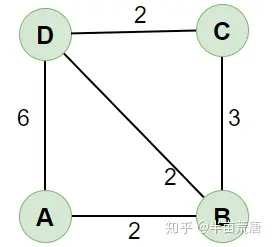

# 校园导航系统  
## 1.校园导航的实现  
> 通过拓扑学的方式，将校园地点和路径抽象成点和线  
> 通过Dijkstra算法，计算各点之间的最优路径  
## 2.Dijstra算法  
> Dijkstra 算法是一个基于「贪心」、「广度优先搜索」、「动态规划」求一个图中一个点到其他所有点的最短路径的算法  
> 计算最短路径时，每次从 「未求出最短路径的点」中 取出 距离距离起点 最小路径的点，以这个点为桥梁 刷新「未求出最短路径的点」的距离  
    
> 上图中，我们若想求A点到各点的距离
> 设A到各点的距离为正无穷，从接近的B点开始，A->B的距离为2，小于正无穷，更新  
> 此时 B:前驱为A 距离为2 C:前驱为A 距离为∞ D:前驱为A 距离为∞  
> 再到D,A->D的距离为6，小于正无穷，更新  
> 此时 B:前驱为A 距离为2 C:前驱为A 距离为∞ D:前驱为A 距离为6  
> 我们发现，A->B->D的最短路径为4，小于A->D，更新  
> 此时 B:前驱为A 距离为2 C:前驱为A 距离为∞ D:前驱为B 距离为2  
> 再到C，C不与A直接连接，则找C最短的前驱为B，更新  
> 此时 B:前驱为A 距离为2 C:前驱为B 距离为3 D:前驱为B 距离为4  
## 3.程序的实现
> 结点部分
``` c++
struct MGraph
{
    int edges[MAX][MAX];//邻接矩阵，记录的是两点之间的距离，也就是权值
    int n, e;//顶点数和边数
} G;
```  
> 类部分
``` c++
class dij
{
private:
    int dist[MAX], path[MAX];           //储存最短距离和路径
public:
    void init();                        //初始化邻拉矩阵
    void printf_MG();                   //输出矩阵
    void Dijkstra(MGraph g, int u);     //计算各点到每一个点的最短路径
    void printf_path(int u, int x);     //输入两点，输出两点间的最短路径与距离
};
```
> 各函数部分  
``` c++
/*初始化矩阵*/
void dij::init()
{
    
    int i,j;
    G.n = 9, G.e = 13;
    for (i = 0; i < G.n; i++)
    {
        for (j = 0; j < G.n; j++)
        {
            G.edges[i][j] = INF;
        }
    }
    G.edges[0][1] = 10;
    G.edges[0][2] = 15;
    G.edges[1][3] = 20;
    G.edges[1][4] = 5;
    G.edges[2][5] = 8;
    G.edges[2][6] = 6;
    G.edges[3][7] = 7;
    G.edges[4][5] = 10;
    G.edges[4][7] = 3;
    G.edges[4][8] = 4;
    G.edges[5][6] = 9;
    G.edges[5][8] = 3;
    G.edges[6][8] = 12;
    for (i = 0; i < G.n; i++)
    {
        for (j = 0; j < G.n; j++)
        {
            if (G.edges[i][j] != INF)
            {
                G.edges[j][i] = G.edges[i][j];
            }
        }
    }
    for (i = 0; i < G.n; i++)
        G.edges[i][i] = 0;
}
```

``` c++
//计算各点到每一个点的最短路径
void dij::Dijkstra(MGraph g, int u)
{
    int U[MAX], mmin;//分别表示已经遍历过的点、距当前起始点最近的点的距离
    //对各数组进行初始化
    int i, j;
    for (i = 0; i < g.n; i++)
    {
        U[i] = 0;
        path[i] = -1;
    }
    //me(dist,INF);
    for (int i = 0; i < g.n; i++)
    {
        dist[i] = g.edges[u][i];
        if (g.edges[u][i] < INF)
            path[i] = u;
    }
    dist[u] = 0;//到本身的距离
    for (int i = 0; i < g.n; i++) //求出源点到n个点的最短距离
    {
        mmin = INF;
        U[u] = 1;//将选出的新的起始点放入U数组中
        for (int j = 0; j < g.n; j++)
            //这个if判断顶点u的加入是否会出现通往顶点j的更短的路径，如果出现，则改变原来路径及其长度，否则什么都不做
        {
            if (!U[j] && dist[u] + g.edges[u][j] < dist[j])
            {
                dist[j] = dist[u] + g.edges[u][j];//更新路径长度
                path[j] = u;//更新到顶点j的路径
            }
        }
        for (int j = 0; j < g.n; j++)
            //这个循环每次从剩余顶点中选出一个顶点，通往这个顶点的路径在通往所有剩余顶点的路径中是长度最短的
        {
            if (U[j] == 0 && dist[j] < mmin)
            {
                u = j;
                mmin = dist[j];
            }
        }
    }
}
```
``` C++
//输入两点，输出两点间的最短路径与距离
void dij::printf_path(int u, int x)
{
    int a[MAX], cou = 0, ex = x;
    if (u == x)
        printf("%d-->%d=0", u, x);
    else if (path[x] == -1)
        printf("%d-->%d=∞", u, x);//没有路径
    else
    {
        while (x != u)
        {
            a[cou++] = x;
            x = path[x];
        }
        a[cou] = x;
        for (int i = cou; i > 0; i--)
            printf("%d-->", a[i]);
        printf("%d=%d", a[0], dist[ex]);
    }
    printf("\n");
}
```
## 4.程序的使用
> 输入初始位置和目标位置，寻找最短路径和距离